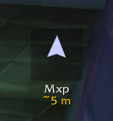
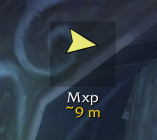

# Find Friend

A compass arrow that points to a party or raid member, for World of Warcraft
3.3.5a (WotLK). Made for battlegrounds: keep an arrow on your duo, on the flag
carrier, or on both at once.

## What it does

 

An arrow on screen points at whoever you are tracking, showing their name and
the distance to them. It rotates as you turn, so "straight ahead" always means
straight ahead.

The colour tells you how well you are aimed: **pale blue and glowing** when
they are in front of you (left), **yellow** when you still have to turn
(right), and green when you are basically on top of them. It also shows an
estimated time to reach them once it knows how fast you move, and their
health percentage - green, yellow or red, like a health bar.

You can track up to **3 people at the same time**, one arrow each.

## How to use it

**Double-click your target's portrait** to start tracking them. Double-click
again to stop. Double-click an arrow to remove that one. Drag any arrow to
move them all.

| Command | What it does |
| --- | --- |
| `/ff <name>` | Track that player |
| `/ff target` | Track your current target |
| `/ff off` | Stop tracking everyone |
| `/ff off <name>` | Stop tracking just that one |
| `/ff units` | Switch between meters and yards |
| `/ff hp` | Show or hide their health percentage |
| `/ff icon` | Next arrow icon (or `/ff icon 3` to pick one) |
| `/ff test` | Try the arrow without needing another player |

## Does the other person need this addon?

**If they are in your group or raid: no.** Their position comes from the
game's own API. They do not need anything installed and never know you are
tracking them. The only requirement is that you are both on the same map.

**If they are not in your group: yes.** Their position has to be sent over,
and that only works if they are running Find Friend too. It is not compatible
with Carbonite: the arrow logic was rebuilt from it, but the way positions are
exchanged is its own.

## Arrow icons

Six styles, picked by number: `/ff icon 1` through `/ff icon 6`, or just
`/ff icon` to step to the next one.

Styles 1 to 5 load `.tga` files from `Media/` that are **not included** — they
are game files, so you copy them yourself; `Media/LEEME.txt` says which ones
and from where. **Style 6 uses a texture already in the game and needs
nothing**, so it works out of the box.

## Install

Drop the `FindFriend` folder into `Interface\AddOns`.

## Credits

The arrow logic is a reimplementation of Carbonite's **Track Player** feature
(its `Nx.HUD` module) for a standalone addon.
